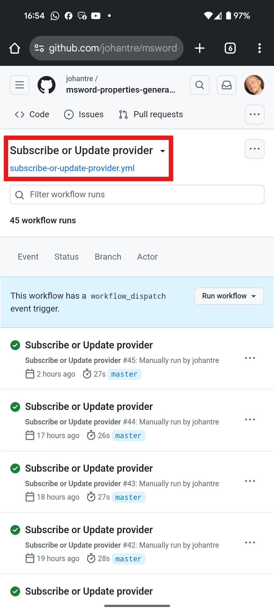
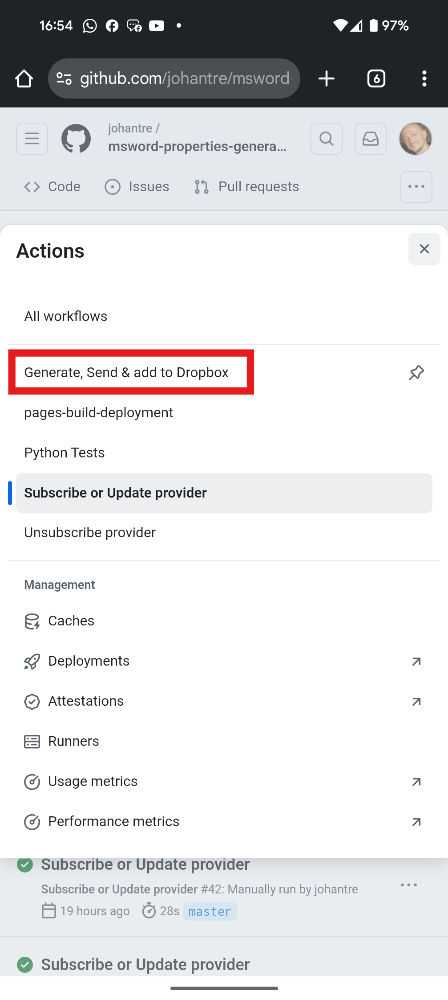
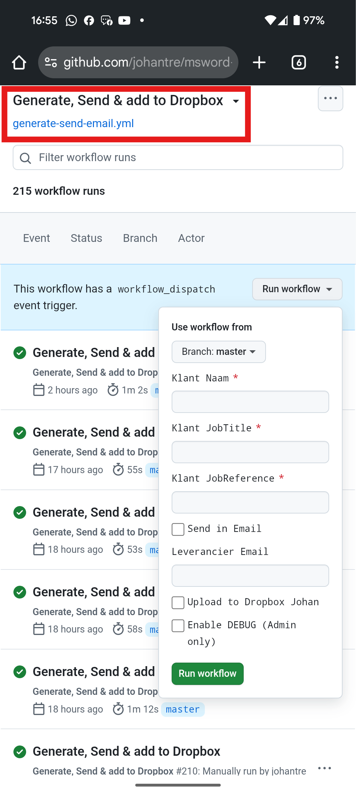
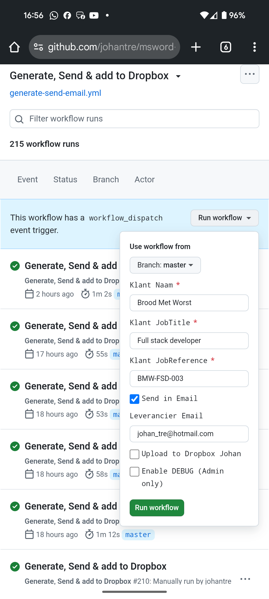

# MSWord Signature Loader

This repo helps the [msword-properties-generator](https://github.com/johantre/msword-properties-generator) repo and explains how to upload your signature image to the private repo [msword-private-assets](https://github.com/johantre/msword-private-assets) in case one does not have an image download link available on Dropbox or Google Drive. 

## Some background
Under the hood, instead of Dropbox or Google Drive, the services of [Uguu.se](https://uguu.se/) are being used to provide a temporary download link in the workflow to store on Provider data in the private repo [msword-private-assets](https://github.com/johantre/msword-private-assets)\
[Uguu](https://uguu.se/) is a service that 
- Doesn't need an account.
- Stores your image for 3 hours.
- Removes your image after that period.
- Has API support.
- The link [Uguu](https://uguu.se/) returns is only seen to you, and unless you pass that link to others, it stays only known by you. 

🗨️ "Why not directly committing & pushing to that private repo?" 🗨️"Why using a step in between?" you might ask.\
That would leave quite a few problems unresolved:
- The permissions to repo where the images are stored would have to be managed, which isn't sustainable.
- Privacy: it would be possible to download all images stored, even though they are encrypted and stored with a hashed file name.
- The encryption would have to be done client side, which leaves too much complexity for the user.
- We don't want to leave any traces in the repo of the unencrypted image. The only version of your image in the private repo is the encrypted version.

## ⚠️ Dependencies ⚠️
Below, everything what's under the hood.
- [Uguu.se](https://uguu.se/)
- [msword-signature-proxy](https://github.com/johantre/msword-signature-proxy). Cloudflare Worker script to assure requests to [Uguu.se](https://uguu.se/) are done with the sufficient headers.

## Usage 
This helper repo is hosted through GitHub Pages. All you need is the link to get started.\
It can be used through desktop or mobile. Most practical is mobile, as this offers you the means of taking a snap and work with that directly, but desktop works as well.\
Below is a step-by-step guide on mobile to illustrate.\
💡The actual production link💡:  
- **https://johantre.github.io/msword-signature-loader/**

### Snap and adjust
- On mobile, clicking the **"Snap Signature"** button opens up the camera app so you can take a snap of your signature.\
Then adjust cropping, contrast and brightness to make your signature match with the background of the document it will be placed on.\
On desktop, that same button will show **"Choose Signature image"**, where you can select an image from your device.\
Once the image is loaded, the other controls will appear.
- Signature snaps can be taken in an other orientation than shown on screen. Use the rotation buttons to orient them correctly.  
- Click **"Crop"** at the bottom, and 
- Click **"Upload"** to copy the generated link to your clipboard.\
Once the Upload button is clicked the other controls are disabled. In case you want to take another snap, click the "Snap Signature" again.
- In case you copied something else and lost the download [Uguu](https://uguu.se/) link from your clipboard, you have a **"Copy link again"** button.
- Click the **"GitHub Actions form"** button to start the workflow of filling out the Provider data, including copy pasting the [Uguu](https://uguu.se/) download link. 

### Using the link
If you clicked **"Open GitHub Actions form"** you'll see the first screen below. ⚠️ Notice ⚠️ you'll need a GitHub account to start this workflow!
- Here you click the **"Run workflow"** button (which won't be available if you didn't log in).\
You'll see the input screen (same as explained in [msword-properties-generator](https://github.com/johantre/msword-properties-generator) README.md).
- On mobile, **long-press the signature field** at the bottom of the form, select **"Paste"** to paste your [Uguu](https://uguu.se/) link from your clipboard.
- Fill out the other Provider data fields.
- Hit **"Run workflow"** at the bottom to persist your Provider data to the private repo.\
Not sure what to fill out there?  Check out the template document [Recht om te vertegenwoordigen.docx](../../res/Recht om te vertegenwoordigen.docx) in this repo for some guidance. The fields are named so you know what data to fill out where. 

### Using together with Customer data
Above, we filled out the Provider data.  Below we'll fill out the Customer data and generate the goodies we're after.\
See [msword-properties-generator](https://github.com/johantre/msword-properties-generator) README.md for more info.

Once the above workflow did run, your screen will look like the first screen below.\
We'll need to run another workflow to generate the document pair with all the filled out data.
- **Click the workflow selector** on top.
- Select **"Generate, Send & add to Dropbox"**.
- Fill out the Customer data.
- Fill out the Provider mail again, ⚠️the same as in the Provider workflow⚠️.
- Hit the **"Run workflow"** at the bottom.

### The result 
Below what'll be the result of using your Provider data, like the signature download link.

- If you clicked **"Run workflow"** you'll see the first screen below. That means your workflow is running.  
- Providing you selected to receive mail, you'll see mail in the mailbox of the provided mail as in the second screen.
- Lo and behold; opening up the .pdf shows the signature as provided in the first step in this README.md

